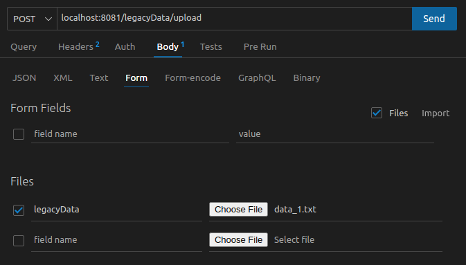

# LuizaLabs Challenge

Solução para o desafio de backend da LuizaLabs.

## Contextualização

Para a resolução do desafio, optei por utilizar a Clean Architecture, pois acredito que seja
uma das melhores arquiteturas para se desenvolver software até o presente momento. Esta arquitetura permite focar em desenvolver as principais regras de negócio, permitindo adiar decisões mais concretas tais como o qual o **Banco de Dados** a ser utilizado. Aqui, os softwares também são mais extensivos, já que a CA permite a inclusão de componentes com as devidas resposabilidades segregadas, além de serem melhores testados, onde cada parte pode ser testada individualmente sem problemas de acoplamento.


## Tecnologias utilizadas

- **TypeScript + NodeJS + Express:** Ferramenta para construção de aplicações JavaScript type-safe, Runtime performática e cheia de funcionalidades para as tarefas triviais e um Framework para construção de aplicações Web direto ao ponto
- **PostgreSQL:** Banco de Dados extensivo, robusto e com suporte à vários tipos de dados
- **Docker + Docker Compose:** Ferramentas para empacotamento de aplicações e distribuição entre diferentes ambientes de desenvolvimento

## Uso da Aplicação

Verifique se os seguintes recursos estão instalados:

- Docker
- Docker Compose

>Preencha os arquivos **.env** e **.env.database**

Para executar a aplicação, execute o seguinte comando:

```sh
  make run-server
```

### Endpoints

>Para fazer a importação de dados

```http
POST /legacyData/upload HTTP/1.1
Host: localhost:8081
Content-Type: multipart/form-data
``````

#### Parâmetros

O arquivo de dados vai no campo "files" do corpo da requisição com o nome "legacyData"




>Para fazer consulta de dados

```http
GET /orders HTTP/1.1
Host: localhost:8081
Content-Type: application/json
``````

#### Parâmetros

```json
{
  "orderId": "122",
  "purchaseDateRangeStart": "2021-12-01",
  "purchaseDateRangeEnd": "2021-12-31"
}
```

**Observações**:

- Os campos purchaseDateRangeStart e purchaseDateRangeEnd precisam estar presentes juntos
- Os campos purchaseDateRangeStart e purchaseDateRangeEnd estão no formato **YYYY-MM-DD**
- É possível fazer a consulta sem nenhum parâmetro
